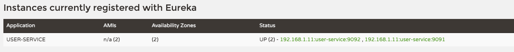
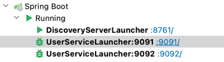

# reader
Blogging app for maat readers

## Service Discovery

DiscoveryServer is a eureka server and lets all the services annotated with @EnableDiscoveryClient to register with itself and helps in getting discovered.

## Service/API Gateway

Auto route configuration is available out of the box and works with the service name that is appearing on the eureka dashboard.

so, if you wish to hit user service via the gateway, it'd look like:

<protocol>://<hostname>:<service-gateway-port>/USER-SERVICE/<URI>
Example: http://localhost:8080/USER-SERVICE/user/hi

### Note

You will have to provide the all upercase service name, which is not very nice all the time.
To avoid that we need to implement custom routing logic in our gateway.

### Custom Routing

Depeding on your configuration the url shown above will change.
In this case it'd be: http://localhost:8080/users/hi

-- the user-service path /user is updated to /users